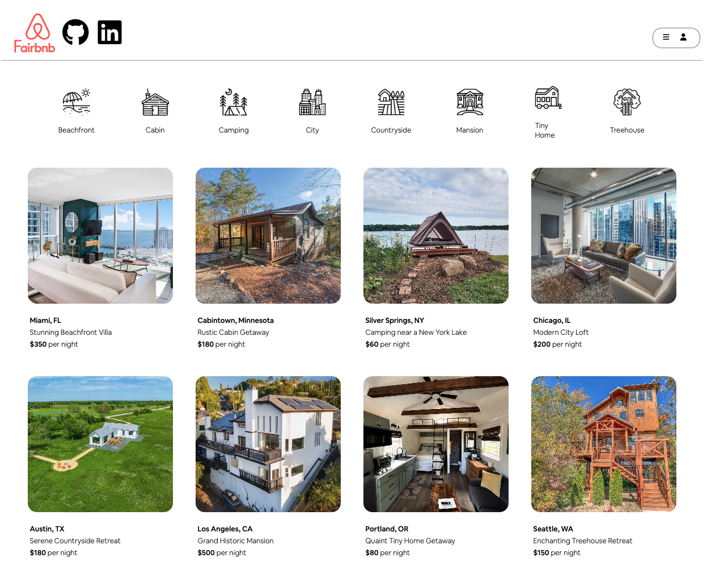

# Fairbnb

Welcome to **Fairbnb**. Are you tired of high priced rentals and high fees? Then you’ve come to the right place. Fairbnb is an online marketplace where users can find fair and reasonably priced rentals with no hidden fees. That way you can travel more and live your life to its fullest. Make an account, login, and start exploring dazzling listings at Fairbnb.

[Fairbnb's Live Website](https://fairbnb-jcgn.onrender.com/)

---

## Functionality & MVPs

In **Fairbnb**, users will be able to:
- View listings of exciting places they can visit
- Search listings by categories they are interested in
- Reserve a listing for specific dates
- Leave reviews for listings they have stayed at

---

## Implementation Timeline

### 1. User authentication: new account creation, login, and demo login (05/27, 5 days)
* Users can sign up for a new account and login/logout to their account
* Users can use a demo login to test the site
* Users are restricted from accessing certain features unless they are logged in: reservations

### 2. Listings (06/01, 5 days)
* Users and site visitors can view all listings
* Users and site visitors can view individual listings

### 3. Reservations - CRUD (06/06, 2 days)
* Users can reserve listings
* Users can view, edit, and cancel(delete) their reservations

### 6. Hosting & Production README (06/08, 1 day)

---

## Future Implementations
* Users can search for listings based on desired filters
* Users can create a profile where they can be reviewed by hosts
* Hosts can create a profile where they list all of their listings and reviews

---

## CC Licensing
- Images from airbnb.com
- Icons from flaticon.com